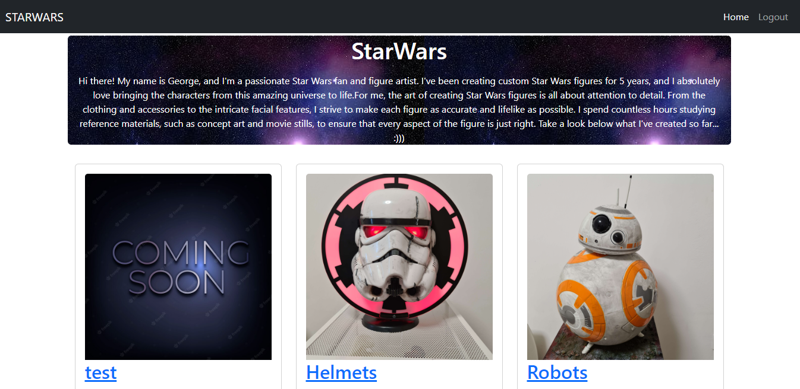
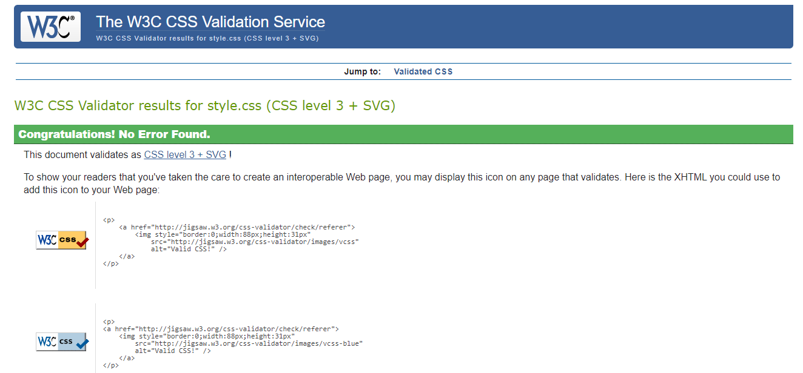
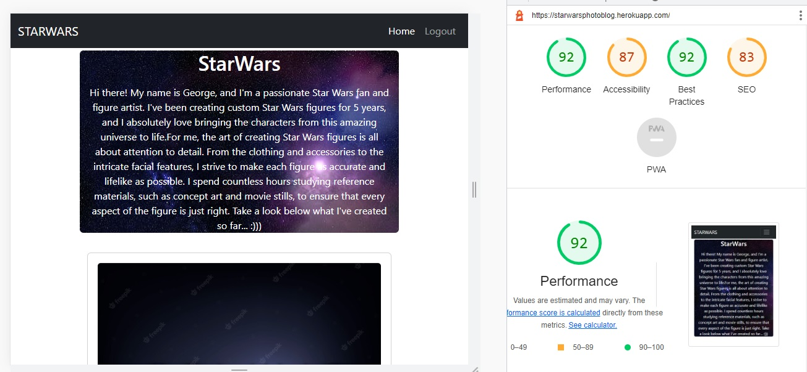

<h1 align="center">Star Wars PhotoBlog</h1>

[View the live project here.](https://starwarsphotoblog.herokuapp.com/)

Welcome to Star Wars Photoblog, a place where you can find a stunning collection of custom Star Wars figures  This blog is dedicated to show the hard work and the great passion of a friend of mine about Star Wars. He is creating custom Star Wars (and many others) figures for several years now. This blog can help him to get feedbacks from people with the same interests. 

## User Experience (UX)

-   ### User stories

    -   #### First Time Visitor Goals

        1. As a First Time Visitor, I want to easily understand the main purpose of the site and learn more about the Ironman Triathlon.
        2. As a First Time Visitor, I want to be able to easily navigate throughout the site to find content.
        3. As a First Time Visitor, I want to look for testimonials to understand what their users think of them and see if they are trusted. I also want to locate their social media links to see their followings on social media to determine how trusted and known they are.

    -   #### Returning Visitor Goals

        1. As a Returning Visitor, I want to find information and personal experiences.
        2. As a Returning Visitor, I want to find the best way to get in contact with people with the same goals.
        3. As a Returning Visitor, I want to find community links.


## Features

-   Responsive on all device sizes

-   Interactive elements

## Technologies Used

### Languages Used

-   [HTML5]
-   [CSS3]
-   [Python]

### Frameworks, Libraries & Programs Used

1. [Bootstrap 5.2:](https://getbootstrap.com/docs/4.4/getting-started/introduction/)
    - Bootstrap was used to assist with the responsiveness and styling of the website.
1. [Django](https://ianlunn.github.io/Hover/)
    - Hover.css was used on the Social Media icons in the footer to add the float transition while being hovered over.
1. [Google Fonts:](https://fonts.google.com/)
    - Google fonts were used to import the 'Titillium Web' font into the style.css file which is used on all pages throughout the project.
1. [Font Awesome:](https://fontawesome.com/)
    - Font Awesome was used on all pages throughout the website to add icons for aesthetic and UX purposes.
1. [Git](https://git-scm.com/)
    - Git was used for version control by utilizing the Gitpod terminal to commit to Git and Push to GitHub.
1. [GitHub:](https://github.com/)
    - GitHub is used to store the projects code after being pushed from Git.


## Testing

The W3C Markup Validator and W3C CSS Validator Services were used to validate every page of the project to ensure there were no syntax errors in the project.

-   [W3C Markup Validator](https://jigsaw.w3.org/css-validator/#validate_by_input)


  -  Lighthouse chechk results:

### Testing User Stories from User Experience (UX) Section

-   #### First Time Visitor Goals

    1. As a First Time Visitor, I want to easily understand the main purpose of the site and learn more about the organisation.

        1. Upon entering the site, users are automatically greeted with a clean and easily readable navigation bar to go to the page of their choice. Underneath there is a Hero Image with Text and a "Learn More" Call to action button.
        2. The main points are made immediately with the hero image
        3. The user has two options, click the call to action buttons or scroll down, both of which will lead to the same place, to learn more about the organisation.

    2. As a First Time Visitor, I want to be able to easily be able to navigate throughout the site to find content.

        1. The site has been designed to be fluid and never to entrap the user. At the top of each page there is a clean navigation bar, each link describes what the page they will end up at clearly.
        2. At the bottom of the first 3 pages there is a redirection call to action to ensure the user always has somewhere to go and doesn't feel trapped as they get to the bottom of the page.
        3. On the Contact Us Page, after a form response is submitted, the page refreshes and the user is brought to the top of the page where the navigation bar is.

    3. As a First Time Visitor, I want to look for testimonials to understand what their users think of them and see if they are trusted. I also want to locate their social media links to see their following on social media to determine how trusted and known they are.
        1. Once the new visitor has read the About Us and What We Do text, they will notice the Why We are Loved So Much section.
        2. The user can also scroll to the bottom of any page on the site to locate social media links in the footer.
        3. At the bottom of the Contact Us page, the user is told underneath the form, that alternatively they can contact the organisation on social media which highlights the links to them.


### Further Testing

-   The Website was tested on Google Chrome, Internet Explorer, Microsoft Edge and Safari browsers.
-   The website was viewed on a variety of devices such as Desktop, Laptop, iPhone7, iPhone 8 & iPhoneX.
-   A large amount of testing was done to ensure that all pages were linking correctly.
-   Friends and family members were asked to review the site and documentation to point out any bugs and/or user experience issues.
- I have testet each section of this webapp as well the functions in it, but because of a lack of time, i haven't documented everything an i am sorry about that.


### Features Left to Implement
There are too many things that can develop this webapp and make it more useful, but this is just the start.
- I would like to give the users the functionality to reply on each others comments.
- Create a lightbox gallery.
- The functionality to comment on each image.
- Etc...........


## Deployment

[Link to deployed website](https://starwarsphotoblog.herokuapp.com/)

This project was developed using GitPod, pushed to GitHub and deployed using Heroku.

To deploy to Heroku from the GitHub repository, the following steps were taken:

1. Go to heroku.com and log in
2. Click on "Create new app"
3. Go to Deploy > Deployment method > Github
4. Go to Settings > Config vars and add variables
5. Git add / commit / push Procfile and requirements.txt files
6. Enable automatic deployments from Heroku
7. Click on Deploy branch
10. Add Config Vars in Heroku to use user's credentials to access AWS

### Forking the GitHub Repository

By forking the GitHub Repository we make a copy of the original repository on our GitHub account to view and/or make changes without affecting the original repository by using the following steps...

1. Log in to GitHub and locate the [GitHub Repository](https://github.com/Xhorxh/StarWars-PhotoBlog)
2. At the top of the Repository (not top of page) just above the "Settings" Button on the menu, locate the "Fork" Button.
3. You should now have a copy of the original repository in your GitHub account.

### Making a Local Clone

1. Log in to GitHub and locate the [GitHub Repository](https://github.com/Xhorxh/StarWars-PhotoBlog)
2. Under the repository name, click "Clone or download".
3. To clone the repository using HTTPS, under "Clone with HTTPS", copy the link.
4. Open Git Bash
5. Change the current working directory to the location where you want the cloned directory to be made.
6. Type `git clone`, and then paste the URL you copied in Step 3.

```
$ git clone https://github.com/Xhorxh/StarWars-PhotoBlog
```

7. Press Enter. Your local clone will be created.

```
$ git clone https://github.com/Xhorxh/StarWars-PhotoBlog
> Cloning into `CI-Clone`...
> remote: Counting objects: 10, done.
> remote: Compressing objects: 100% (8/8), done.
> remove: Total 10 (delta 1), reused 10 (delta 1)
> Unpacking objects: 100% (10/10), done.
```

Click [Here](https://help.github.com/en/github/creating-cloning-and-archiving-repositories/cloning-a-repository#cloning-a-repository-to-github-desktop) to retrieve pictures for some of the buttons and more detailed explanations of the above process.

## Credits

### Code

-   The background image came from [Pexels](https://www.pexels.com/)
- The Comming Soon image came from [Freepik](https://www.freepik.com/free-photo/coming-soon-word-metallic-text-style_17128543.htm#query=comming%20soon&position=0&from_view=search&track=ais">Image by rawpixel.com)

-   [Bootstrap5.2](https://getbootstrap.com/docs/4.4/getting-started/introduction/): Bootstrap Library used throughout the project mainly to make site responsive using the Bootstrap Grid System.


### Content

-   All content was written by the developer.
-   A big thank you to John Elder for his amazing tutorial in [Youtube](https://www.youtube.com/watch?v=B40bteAMM_M&list=PLCC34OHNcOtr025c1kHSPrnP18YPB-NFi), which made me understand a lot. I have used some of his code after updating for my needs.
-   To create the PostImage model (to be able to upload multiple images) I've been through a lot of tutorials and the best was this one (https://soshace.com/upload-multiple-images-to-a-django-model-without-plugins/)


### Media

-   All images are used with te permition of the owner, who is a friend of mine (p.s He doesn't want to write his name here).

### Acknowledgements

-   My Mentor for continuous helpful feedback.
-   The staff of Studen Care for understanding me :)